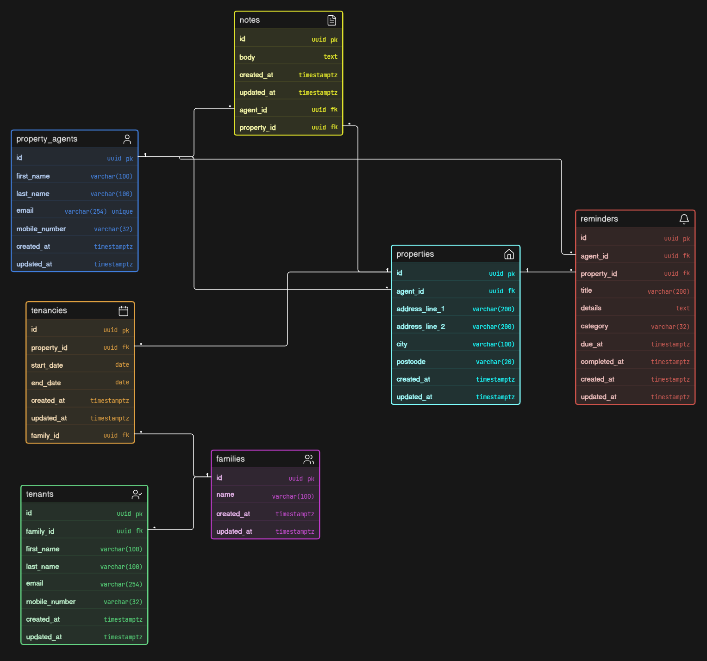
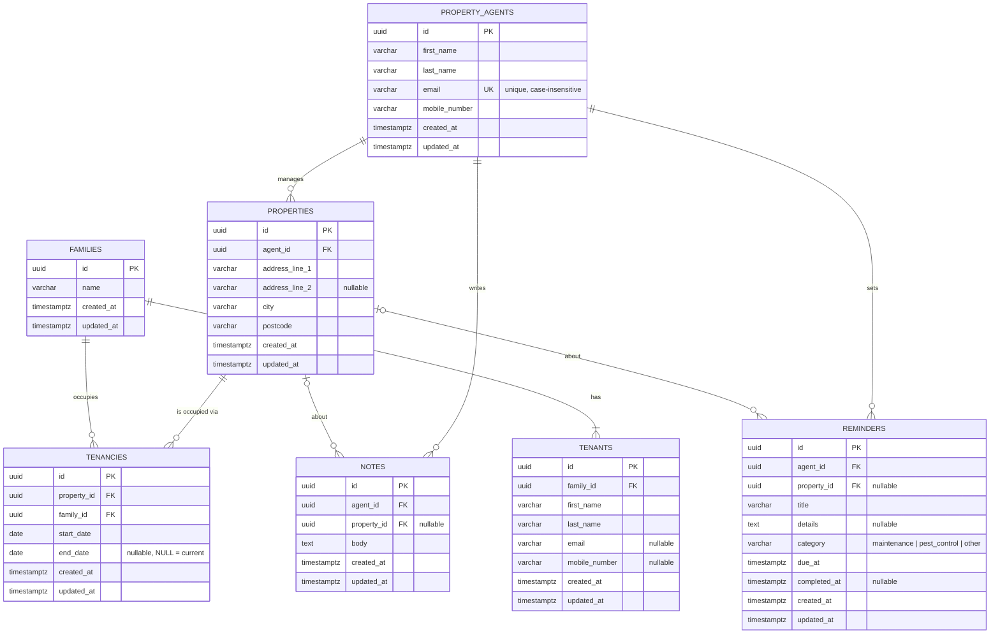

# Relational Data Model

This is a design artifact, not a migration. It models the domain described by
the assignment so the system-design discussion has a concrete reference.

Only `property_agents` is implemented by the API, and it is stored in memory
behind a repository abstraction. Every other table exists here to show how the
domain would be shaped once persistence is introduced.

## Diagram

## Mermaid source

## Conventions

- Primary keys are `uuid`, generated by the application (`crypto.randomUUID()`), so ids never depend on a database sequence.
- Every table carries `created_at` and `updated_at` as `timestamptz NOT NULL`, set by the server in UTC and never accepted from clients.
- Names are `snake_case`; the API exposes them as `camelCase`.

## Tables

### property_agents

| Column          | Type           | Null | Constraints / notes                                                            |
| --------------- | -------------- | ---- | ------------------------------------------------------------------------------ |
| `id`            | `uuid`         | no   | PK                                                                             |
| `first_name`    | `varchar(100)` | no   | trimmed, non-empty                                                             |
| `last_name`     | `varchar(100)` | no   | trimmed, non-empty                                                             |
| `email`         | `varchar(254)` | no   | unique index on `lower(email)`; stored trimmed, compared case-insensitively    |
| `mobile_number` | `varchar(32)`  | no   | trimmed; no country-specific format enforced                                   |
| `created_at`    | `timestamptz`  | no   |                                                                                |
| `updated_at`    | `timestamptz`  | no   | changes on every update; `created_at` never does                               |

The max lengths above are the source of truth for the API's validation rules.

### properties

| Column           | Type           | Null | Constraints / notes                     |
| ---------------- | -------------- | ---- | --------------------------------------- |
| `id`             | `uuid`         | no   | PK                                      |
| `agent_id`       | `uuid`         | no   | FK → `property_agents.id`, `RESTRICT`   |
| `address_line_1` | `varchar(200)` | no   |                                         |
| `address_line_2` | `varchar(200)` | yes  |                                         |
| `city`           | `varchar(100)` | no   |                                         |
| `postcode`       | `varchar(20)`  | no   |                                         |
| `created_at`     | `timestamptz`  | no   |                                         |
| `updated_at`     | `timestamptz`  | no   |                                         |

### families

| Column       | Type           | Null | Constraints / notes                    |
| ------------ | -------------- | ---- | -------------------------------------- |
| `id`         | `uuid`         | no   | PK                                     |
| `name`       | `varchar(100)` | no   | e.g. "The Reyes family"                |
| `created_at` | `timestamptz`  | no   |                                        |
| `updated_at` | `timestamptz`  | no   |                                        |

### tenants

| Column          | Type           | Null | Constraints / notes                  |
| --------------- | -------------- | ---- | ------------------------------------ |
| `id`            | `uuid`         | no   | PK                                   |
| `family_id`     | `uuid`         | no   | FK → `families.id`, `CASCADE`        |
| `first_name`    | `varchar(100)` | no   |                                      |
| `last_name`     | `varchar(100)` | no   |                                      |
| `email`         | `varchar(254)` | yes  | not every tenant is a contact person |
| `mobile_number` | `varchar(32)`  | yes  |                                      |
| `created_at`    | `timestamptz`  | no   |                                      |
| `updated_at`    | `timestamptz`  | no   |                                      |

### tenancies

| Column        | Type          | Null | Constraints / notes                                  |
| ------------- | ------------- | ---- | ---------------------------------------------------- |
| `id`          | `uuid`        | no   | PK                                                   |
| `property_id` | `uuid`        | no   | FK → `properties.id`, `RESTRICT`                     |
| `family_id`   | `uuid`        | no   | FK → `families.id`, `RESTRICT`                       |
| `start_date`  | `date`        | no   |                                                      |
| `end_date`    | `date`        | yes  | `NULL` means the tenancy is current                  |
| `created_at`  | `timestamptz` | no   |                                                      |
| `updated_at`  | `timestamptz` | no   |                                                      |

Constraints:

- `CHECK (end_date IS NULL OR end_date >= start_date)`
- Partial unique index on `(property_id) WHERE end_date IS NULL` — a property has at most one current family.

Preventing overlapping *historical* tenancies is possible with a PostgreSQL exclusion constraint on a date range, but that is beyond the scope of this exercise; the partial unique index covers the case that matters operationally.

### notes

| Column        | Type          | Null | Constraints / notes                          |
| ------------- | ------------- | ---- | -------------------------------------------- |
| `id`          | `uuid`        | no   | PK                                           |
| `agent_id`    | `uuid`        | no   | FK → `property_agents.id`, `CASCADE` (owner) |
| `property_id` | `uuid`        | yes  | FK → `properties.id`, `CASCADE`              |
| `body`        | `text`        | no   |                                              |
| `created_at`  | `timestamptz` | no   |                                              |
| `updated_at`  | `timestamptz` | no   |                                              |

### reminders

| Column         | Type           | Null | Constraints / notes                                          |
| -------------- | -------------- | ---- | ------------------------------------------------------------ |
| `id`           | `uuid`         | no   | PK                                                           |
| `agent_id`     | `uuid`         | no   | FK → `property_agents.id`, `CASCADE` (owner)                 |
| `property_id`  | `uuid`         | yes  | FK → `properties.id`, `CASCADE`                              |
| `title`        | `varchar(200)` | no   |                                                              |
| `details`      | `text`         | yes  |                                                              |
| `category`     | `varchar(32)`  | no   | `CHECK (category IN ('maintenance', 'pest_control', 'other'))` |
| `due_at`       | `timestamptz`  | no   |                                                              |
| `completed_at` | `timestamptz`  | yes  | `NULL` means still open                                      |
| `created_at`   | `timestamptz`  | no   |                                                              |
| `updated_at`   | `timestamptz`  | no   |                                                              |

Notes and reminders are deliberately separate: a note is free text, a reminder has a due date and a completion state. Merging them would force nullable "kind"-dependent columns.

## Relationships and cardinality

- A property agent manages zero or more properties; a property has exactly one agent.
- A family has one or more tenants; a tenant belongs to exactly one family.
- A property has zero or more tenancies over time; a family has zero or more tenancies over time.
- A tenancy links one family to one property for a date range. This is what makes "each property has one or more tenants belonging to a single family" true *at a point in time* without hard-wiring `properties.family_id`: a family can move, a property can be re-let, and the history of both survives.
- Notes and reminders always belong to one agent and may optionally point at one property.

## Deletion behaviour

| Parent           | Child                | Rule       | Why                                                                 |
| ---------------- | -------------------- | ---------- | ------------------------------------------------------------------- |
| `property_agents`| `properties`         | `RESTRICT` | Reassign properties first; an unmanaged property is a data bug.     |
| `property_agents`| `notes`, `reminders` | `CASCADE`  | Personal working items owned by that agent.                         |
| `properties`     | `tenancies`          | `RESTRICT` | Occupancy history must survive.                                     |
| `properties`     | `notes`, `reminders` | `CASCADE`  | Operational tasks have no meaning without the property.             |
| `families`       | `tenants`            | `CASCADE`  | Tenants only exist as members of a family.                          |
| `families`       | `tenancies`          | `RESTRICT` | Same reason as properties: keep the history.                        |

The current API deletes an agent unconditionally because no child tables exist in memory. With the schema above, deleting an agent who still manages properties would be rejected and surface as `409 Conflict`.

## Indexes

- `property_agents`: unique on `lower(email)`.
- Every FK column: `properties.agent_id`, `tenants.family_id`, `tenancies.property_id`, `tenancies.family_id`, `notes.agent_id`, `notes.property_id`, `reminders.agent_id`, `reminders.property_id`.
- `tenancies (property_id, end_date)` for "who lives here now" lookups.
- `reminders (agent_id, due_at)` for an agent's upcoming work.

## Assumptions

- An agent's email is unique across the system and compared case-insensitively.
- A property belongs to exactly one agent at a time.
- A tenant belongs to exactly one family; families are the unit of occupancy.
- A family can occupy different properties over time, but only one property at a time.
- Notes and reminders are owned by an agent and may reference a property; they are not shared between agents.
- Timestamps are UTC and owned by the server; clients never set `id`, `created_at` or `updated_at`.
- Ids are UUIDs generated by the application.

## What the API implements today

Only `property_agents`, via `AgentsService → AgentsRepository → InMemoryAgentsRepository (Map<string, Agent>)`. Moving to PostgreSQL means implementing this one table behind the same repository interface; the rest of the schema is the roadmap, not the current scope.
